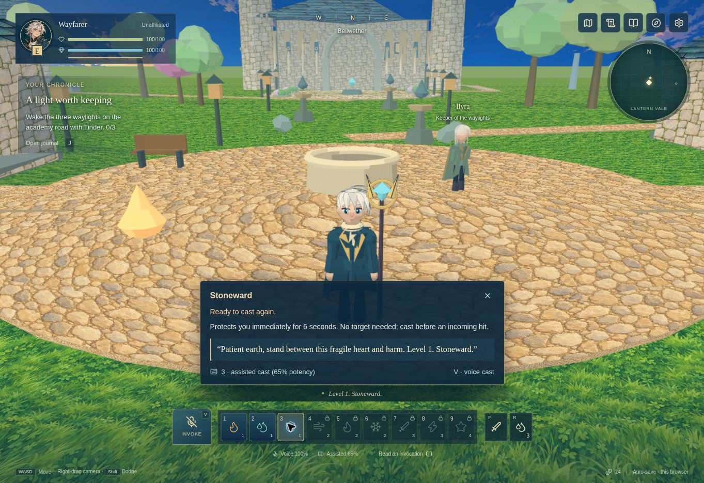
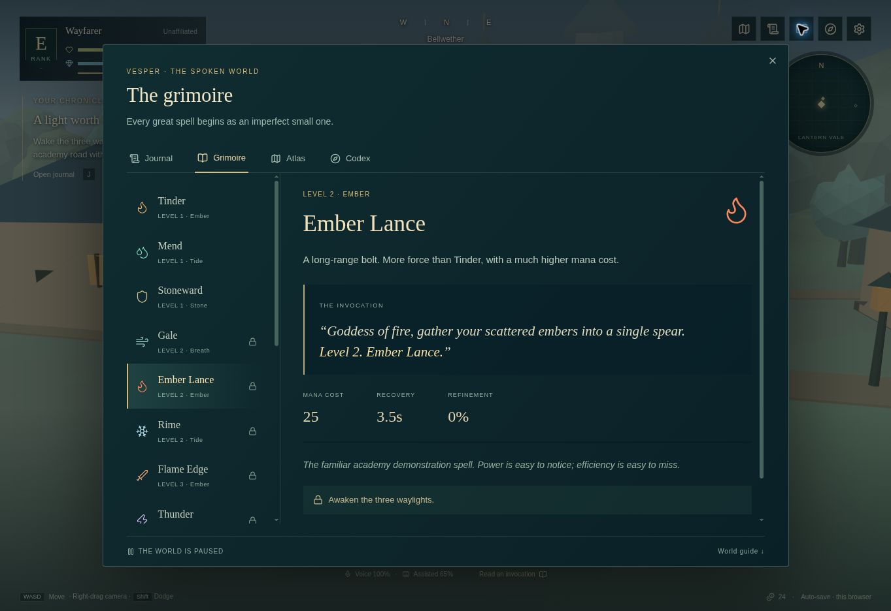
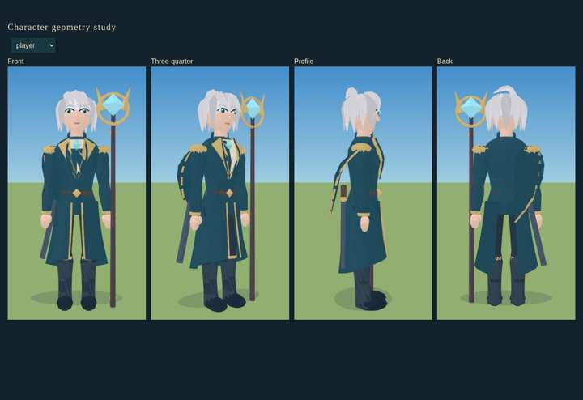
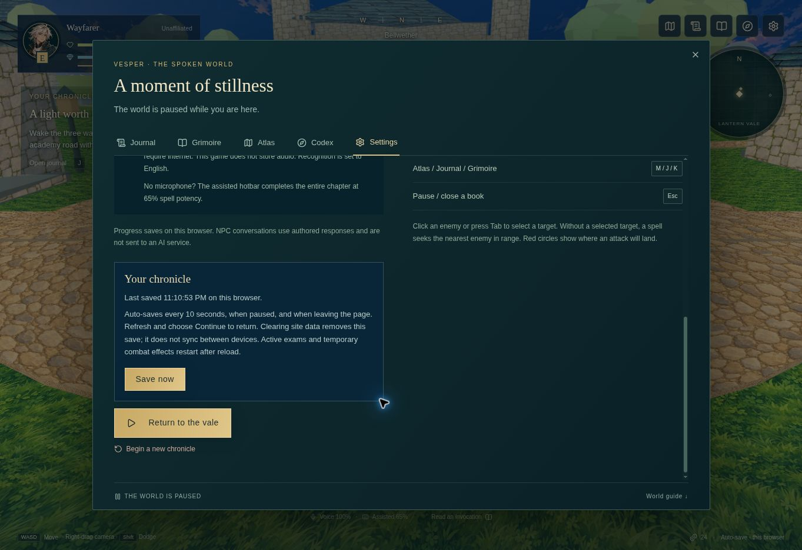

# Vesper — The Spoken World

*The world remembers every word. What will it remember of yours?*

A single-player fantasy RPG about shaping magic with your voice and finding your own way through the Lantern Vale.

## Play the game here

[Play Vesper](https://vesper-concept.netlify.app/) · [Explore the world](public/world-guide.md)

## A glimpse of the vale

*Bellwether, where your first small spells begin a much larger story.*

## Give magic a voice

*Learn an invocation. Speak its level and name. Make the spell your own.*

## Meet your wayfarer

*The latest character design, shown from four angles.*

## Return to your chronicle

*Save your journey, take a break, and return to the vale.*

These images follow the prototype's development. Gameplay and grimoire captures show earlier revisions; the character showcase is the latest design.

## Your first chapter

- Cast nine spells, from a small flame to a falling star.
- Face the academy's trials or learn along the Unbound Road.
- Explore Bellwether, the Hushwood, Northwatch, and the Sunken Choir.
- Refine your magic, enchant your blade, and uncover the silence beneath the vale.

**Chapter I is a playable prototype.** The wider world and later chapters are still being developed.

[Technical documentation](TECHNICAL.md)
